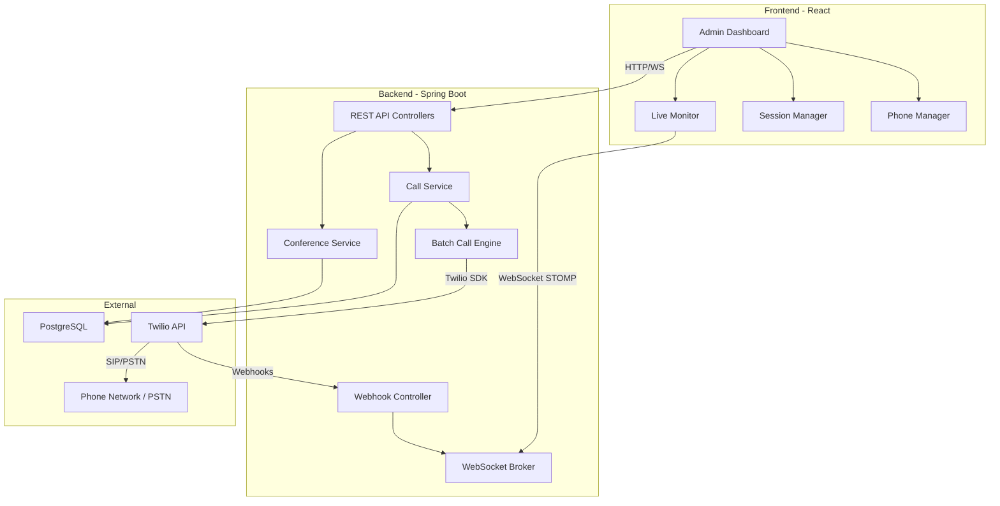
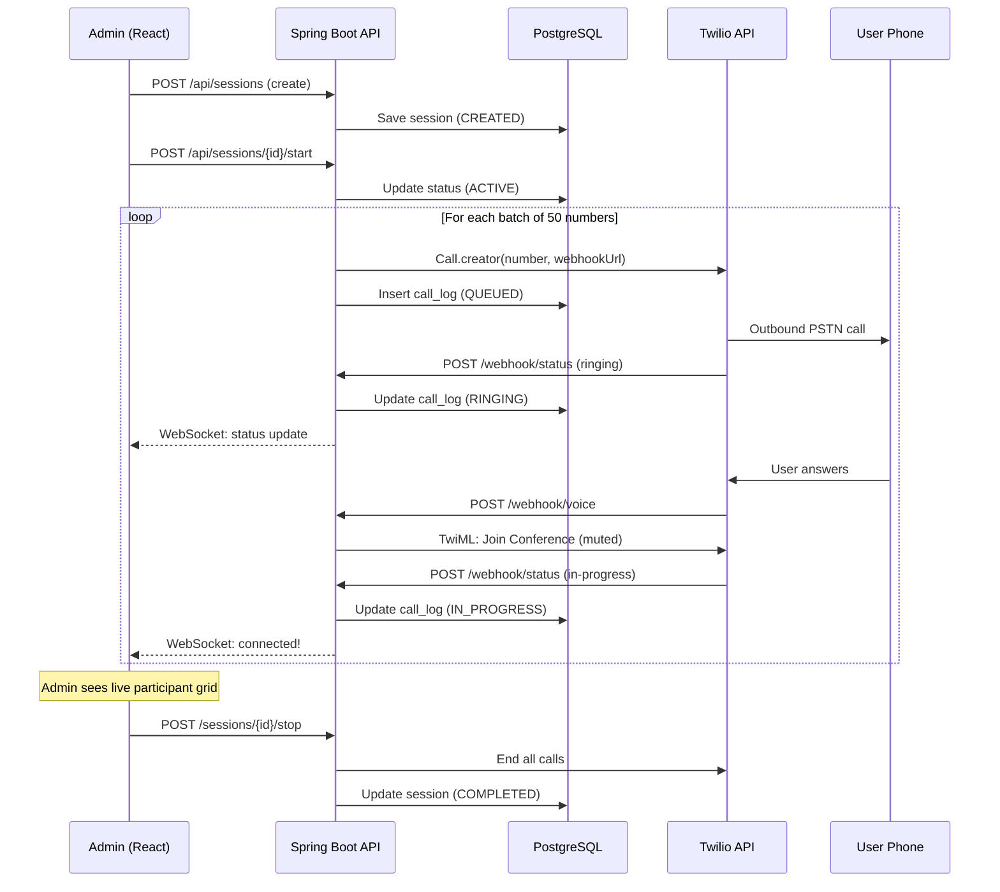

# VoiceCast — Mass Voice Calling & Broadcast System

A scalable telephony-based voice communication system that allows an administrator to initiate bulk voice calls (500+ users) to Bangladeshi phone numbers. End users receive a normal phone call and are connected to a voice broadcast or conference — **no app or internet required**.

## Architecture

- **Backend:** Java Spring Boot 3.2 + Twilio SDK
- **Frontend:** React 19 (Vite) with premium dark-mode UI
- **Database:** PostgreSQL
- **Real-time:** WebSocket (STOMP) for live call monitoring
- **Telephony:** Twilio Programmable Voice (swappable via provider interface)

## Quick Start

### Prerequisites
- Java 17+
- Node.js 18+
- PostgreSQL 14+
- Twilio Account (Account SID, Auth Token, Phone Number)

### 1. Database Setup
```sql
CREATE DATABASE voice_broadcast;
```

### 2. Backend
```bash
cd backend

# Configure environment variables
export TWILIO_ACCOUNT_SID=your_account_sid
export TWILIO_AUTH_TOKEN=your_auth_token
export TWILIO_PHONE_NUMBER=+1234567890
export WEBHOOK_BASE_URL=https://your-public-url.com  # Use ngrok for dev

# Run
./mvnw spring-boot:run
```
Backend runs on `http://localhost:8080`

### 3. Frontend
```bash
cd frontend
npm install
npm run dev
```
Frontend runs on `http://localhost:5173`

### 4. Webhook Setup (Development)
Twilio needs to reach your backend via a public URL:
```bash
# Install ngrok
ngrok http 8080

# Copy the HTTPS URL and set it as WEBHOOK_BASE_URL
```

## Features

| Feature | Description |
|---------|-------------|
| **Bulk Calling** | Batched outbound calls (50/batch) with configurable concurrency |
| **Auto-Retry** | Failed/busy/no-answer calls retried up to 3 times |
| **Broadcast Mode** | Admin speaks, all listeners are muted |
| **Interactive Mode** | Moderated conference with mute/unmute controls |
| **Live Monitoring** | Real-time WebSocket updates on call status |
| **CSV Upload** | Bulk import phone numbers from CSV files |
| **Call Logs** | Full history with export to CSV |

## API Endpoints

### Phone Numbers
| Method | Endpoint | Description |
|--------|----------|-------------|
| GET | `/api/phone-numbers` | List (paginated, filterable) |
| POST | `/api/phone-numbers` | Add single number |
| POST | `/api/phone-numbers/upload` | Bulk CSV upload |
| PUT | `/api/phone-numbers/{id}` | Update |
| DELETE | `/api/phone-numbers/{id}` | Delete |

### Sessions
| Method | Endpoint | Description |
|--------|----------|-------------|
| GET | `/api/sessions` | List all sessions |
| POST | `/api/sessions` | Create session |
| POST | `/api/sessions/{id}/start` | Start calling |
| POST | `/api/sessions/{id}/stop` | Stop session |
| GET | `/api/sessions/{id}/stats` | Live statistics |
| GET | `/api/sessions/{id}/logs` | Call logs |

### Webhooks (Twilio)
| Endpoint | Purpose |
|----------|---------|
| `/webhook/voice` | TwiML for conference join |
| `/webhook/status` | Call status callbacks |
| `/webhook/conference-status` | Conference events |

## Configuration

Key settings in `backend/src/main/resources/application.yml`:

```yaml
app:
  call:
    batch-size: 50          # Calls per batch
    batch-delay-ms: 2000    # Delay between batches
    max-concurrent: 200     # Max concurrent calls
    retry-max: 3            # Max retry attempts
    retry-delay-seconds: 60 # Seconds between retry cycles
```

## BTRC Compliance Notes

- Obtain user consent before adding numbers
- Implement opt-out/DND mechanisms
- Route calls through authorized IGW operators
- Maintain call logs for regulatory audits


# Mass Voice Calling & Broadcast System — Implementation Plan

## Overview

Build a scalable telephony-based voice communication system that allows an admin to initiate bulk voice calls (500+ users) to Bangladeshi phone numbers. End users receive a normal phone call and are connected to a voice broadcast or conference — **no app or internet required** on their side.

**Tech Stack:** Java Spring Boot (backend) · React.js (frontend) · PostgreSQL (database) · Twilio (telephony) · WebSocket/STOMP (real-time updates)

---

## User Review Required

> [!IMPORTANT]
> **Telephony Provider Choice — Twilio vs Asterisk**
> 
> | Factor | Twilio | Asterisk |
> |--------|--------|----------|
> | Setup complexity | Low (cloud API) | High (self-hosted PBX server) |
> | Bangladesh support | Requires Twilio number or verified caller ID | Requires SIP trunk from IPTSP-licensed provider |
> | Cost | Pay-per-call (~$0.02-0.05/min outbound) | SIP trunk subscription + server costs |
> | Scalability | Auto-scales, 500+ concurrent calls supported | Must provision infrastructure |
> | Conference features | Built-in conference rooms, mute/unmute API | MeetMe/ConfBridge — requires config |
> | Maintenance | Zero (managed service) | You maintain the PBX server |
> 
> **Recommendation:** I will implement with **Twilio** as the primary telephony provider due to faster development, built-in conference support, and easier scaling. The architecture will use a **TelephonyProvider interface** so Asterisk/Plivo can be swapped in later.

> [!WARNING]
> **BTRC Regulatory Compliance (Bangladesh)**
> - Bulk calling requires user consent and compliance with BTRC telemarketing guidelines
> - International voice traffic must route through authorized IGW operators
> - You will need a Twilio number with Bangladesh calling capability, OR a local IPTSP-licensed SIP trunk
> - Consider implementing opt-out/DND (Do Not Disturb) mechanisms

> [!CAUTION]
> **Twilio Account Requirements:**
> - A Twilio account with upgraded status (trial accounts have limitations)
> - A purchased Twilio phone number (or verified caller ID for outbound)
> - Your backend server must be publicly accessible (or use ngrok for dev) so Twilio can send webhooks

## Open Questions

1. **Twilio Account:** Do you already have a Twilio account, or should I include setup instructions?
2. **Database:** The plan uses PostgreSQL. Is that acceptable, or do you prefer MySQL?
3. **Authentication:** Should the admin dashboard have user authentication (login/password), or is this an internal-only tool?
4. **Deployment:** Will this run locally for now, or do you need Docker/cloud deployment configs?
5. **Call Recording:** Should calls/conferences be recorded for later playback?

---

## Architecture



---

## Proposed Changes

### Project Structure

```
Audio_Call/
├── backend/                          # Spring Boot application
│   ├── pom.xml
│   ├── src/main/java/com/audiocall/
│   │   ├── AudioCallApplication.java
│   │   ├── config/
│   │   │   ├── TwilioConfig.java
│   │   │   ├── WebSocketConfig.java
│   │   │   └── CorsConfig.java
│   │   ├── controller/
│   │   │   ├── PhoneNumberController.java
│   │   │   ├── CallSessionController.java
│   │   │   ├── TwilioWebhookController.java
│   │   │   └── DashboardController.java
│   │   ├── service/
│   │   │   ├── PhoneNumberService.java
│   │   │   ├── CallSessionService.java
│   │   │   ├── TwilioCallService.java
│   │   │   ├── ConferenceService.java
│   │   │   └── CallRetryService.java
│   │   ├── model/
│   │   │   ├── PhoneNumber.java
│   │   │   ├── CallSession.java
│   │   │   ├── CallLog.java
│   │   │   └── PhoneGroup.java
│   │   ├── repository/
│   │   │   ├── PhoneNumberRepository.java
│   │   │   ├── CallSessionRepository.java
│   │   │   └── CallLogRepository.java
│   │   ├── dto/
│   │   │   ├── CallStatusUpdate.java
│   │   │   ├── SessionRequest.java
│   │   │   ├── SessionStats.java
│   │   │   └── PhoneNumberUpload.java
│   │   └── telephony/
│   │       ├── TelephonyProvider.java        # Interface
│   │       └── TwilioProvider.java           # Twilio implementation
│   └── src/main/resources/
│       ├── application.yml
│       └── schema.sql
│
├── frontend/                         # React application (Vite)
│   ├── package.json
│   ├── index.html
│   ├── src/
│   │   ├── main.jsx
│   │   ├── App.jsx
│   │   ├── index.css
│   │   ├── api/
│   │   │   └── api.js
│   │   ├── components/
│   │   │   ├── Sidebar.jsx
│   │   │   ├── PhoneManager.jsx
│   │   │   ├── SessionPanel.jsx
│   │   │   ├── LiveMonitor.jsx
│   │   │   ├── CallStats.jsx
│   │   │   ├── PhoneUploadModal.jsx
│   │   │   └── ParticipantCard.jsx
│   │   ├── hooks/
│   │   │   └── useWebSocket.js
│   │   └── pages/
│   │       ├── Dashboard.jsx
│   │       ├── PhoneNumbers.jsx
│   │       ├── Sessions.jsx
│   │       └── CallLogs.jsx
│   └── vite.config.js
│
└── README.md
```

---

### Backend — Spring Boot

---

#### [NEW] [pom.xml](file:///run/media/miju_chowdhury/Miju/Project/Audio_Call/backend/pom.xml)

Maven project configuration with dependencies:
- `spring-boot-starter-web` — REST APIs
- `spring-boot-starter-data-jpa` — Database ORM
- `spring-boot-starter-websocket` — STOMP WebSocket for real-time updates
- `spring-boot-starter-validation` — Request validation
- `postgresql` — PostgreSQL driver
- `twilio` (v10.x) — Twilio Java SDK
- `opencsv` — CSV parsing for phone number uploads
- `lombok` — Boilerplate reduction

#### [NEW] [application.yml](file:///run/media/miju_chowdhury/Miju/Project/Audio_Call/backend/src/main/resources/application.yml)

Configuration for:
- PostgreSQL connection (`spring.datasource.*`)
- Twilio credentials (`twilio.account-sid`, `twilio.auth-token`, `twilio.phone-number`)
- Call settings (`call.batch-size: 50`, `call.retry-max: 3`, `call.retry-delay-seconds: 60`)
- Webhook base URL (`app.webhook-base-url`)

#### [NEW] [AudioCallApplication.java](file:///run/media/miju_chowdhury/Miju/Project/Audio_Call/backend/src/main/java/com/audiocall/AudioCallApplication.java)

Standard Spring Boot main class with `@SpringBootApplication`.

---

#### Database Models

#### [NEW] [PhoneNumber.java](file:///run/media/miju_chowdhury/Miju/Project/Audio_Call/backend/src/main/java/com/audiocall/model/PhoneNumber.java)

```java
@Entity
public class PhoneNumber {
    @Id @GeneratedValue
    private Long id;
    private String number;       // E.164 format: +8801XXXXXXXXX
    private String name;         // Contact name (optional)
    private String group;        // Group label for organization
    private boolean active;      // Can be disabled without deleting
    private LocalDateTime createdAt;
}
```

#### [NEW] [CallSession.java](file:///run/media/miju_chowdhury/Miju/Project/Audio_Call/backend/src/main/java/com/audiocall/model/CallSession.java)

```java
@Entity
public class CallSession {
    @Id @GeneratedValue
    private Long id;
    private String title;
    private String conferenceSid;       // Twilio conference SID
    private String conferenceName;      // Unique conference room name
    private SessionMode mode;           // BROADCAST or INTERACTIVE
    private SessionStatus status;       // CREATED, ACTIVE, COMPLETED, CANCELLED
    private LocalDateTime startedAt;
    private LocalDateTime endedAt;
    private int totalNumbers;
    private int connected;
    private int failed;
}
```

#### [NEW] [CallLog.java](file:///run/media/miju_chowdhury/Miju/Project/Audio_Call/backend/src/main/java/com/audiocall/model/CallLog.java)

```java
@Entity
public class CallLog {
    @Id @GeneratedValue
    private Long id;
    
    @ManyToOne
    private CallSession session;
    
    private String phoneNumber;
    private String callSid;            // Twilio call SID
    private CallStatus status;         // QUEUED, RINGING, IN_PROGRESS, COMPLETED, BUSY, FAILED, NO_ANSWER
    private int retryCount;
    private String failureReason;
    private Integer durationSeconds;
    private LocalDateTime initiatedAt;
    private LocalDateTime answeredAt;
    private LocalDateTime endedAt;
}
```

---

#### Core Services

#### [NEW] [TelephonyProvider.java](file:///run/media/miju_chowdhury/Miju/Project/Audio_Call/backend/src/main/java/com/audiocall/telephony/TelephonyProvider.java)

Interface for telephony abstraction:
```java
public interface TelephonyProvider {
    String initiateCall(String toNumber, String conferenceName, String statusCallbackUrl);
    void endCall(String callSid);
    void muteParticipant(String conferenceSid, String callSid, boolean muted);
    void endConference(String conferenceSid);
    String generateConferenceTwiML(String conferenceName, boolean muted);
}
```

#### [NEW] [TwilioProvider.java](file:///run/media/miju_chowdhury/Miju/Project/Audio_Call/backend/src/main/java/com/audiocall/telephony/TwilioProvider.java)

Twilio implementation of `TelephonyProvider`:
- Uses `Call.creator()` to initiate outbound calls
- Points answered calls to a webhook that returns TwiML joining a conference
- Uses `Participant.updater()` for mute/unmute
- Validates Twilio webhook signatures for security

#### [NEW] [CallSessionService.java](file:///run/media/miju_chowdhury/Miju/Project/Audio_Call/backend/src/main/java/com/audiocall/service/CallSessionService.java)

Orchestrates the call session lifecycle:
1. **Create session** — saves session metadata, assigns phone numbers
2. **Start session** — creates Twilio conference, triggers batch call engine
3. **Monitor session** — aggregates real-time stats from call logs
4. **End session** — terminates all active calls, closes conference

#### [NEW] [TwilioCallService.java](file:///run/media/miju_chowdhury/Miju/Project/Audio_Call/backend/src/main/java/com/audiocall/service/TwilioCallService.java)

Handles the bulk call execution with **batching strategy**:

```
Total Numbers: 500+
Batch Size: 50 calls
Batch Interval: 2 seconds
Max Concurrent: 200 calls

Flow:
[Batch 1: 50 calls] → 2s delay → [Batch 2: 50 calls] → 2s delay → ...
```

- Uses `@Async` with a thread pool of size 20 for parallel call initiation
- Each batch is submitted as a group; next batch starts after delay
- Failed/busy numbers are queued for automatic retry (up to 3 attempts)

#### [NEW] [CallRetryService.java](file:///run/media/miju_chowdhury/Miju/Project/Audio_Call/backend/src/main/java/com/audiocall/service/CallRetryService.java)

Scheduled retry service:
- Runs every 60 seconds during active sessions
- Picks up calls with status BUSY, FAILED, NO_ANSWER where `retryCount < maxRetries`
- Re-initiates the call via the telephony provider

---

#### REST Controllers

#### [NEW] [PhoneNumberController.java](file:///run/media/miju_chowdhury/Miju/Project/Audio_Call/backend/src/main/java/com/audiocall/controller/PhoneNumberController.java)

| Method | Endpoint | Description |
|--------|----------|-------------|
| GET | `/api/phone-numbers` | List all numbers (paginated, filterable by group) |
| POST | `/api/phone-numbers` | Add single number |
| POST | `/api/phone-numbers/upload` | Bulk upload from CSV |
| PUT | `/api/phone-numbers/{id}` | Update a number |
| DELETE | `/api/phone-numbers/{id}` | Delete a number |
| DELETE | `/api/phone-numbers/bulk` | Bulk delete |

#### [NEW] [CallSessionController.java](file:///run/media/miju_chowdhury/Miju/Project/Audio_Call/backend/src/main/java/com/audiocall/controller/CallSessionController.java)

| Method | Endpoint | Description |
|--------|----------|-------------|
| GET | `/api/sessions` | List all sessions |
| POST | `/api/sessions` | Create new session |
| POST | `/api/sessions/{id}/start` | Start calling |
| POST | `/api/sessions/{id}/stop` | Stop/end session |
| GET | `/api/sessions/{id}/stats` | Get live stats |
| GET | `/api/sessions/{id}/logs` | Get call logs for session |
| POST | `/api/sessions/{id}/mute/{callSid}` | Mute a participant |
| POST | `/api/sessions/{id}/unmute/{callSid}` | Unmute a participant |

#### [NEW] [TwilioWebhookController.java](file:///run/media/miju_chowdhury/Miju/Project/Audio_Call/backend/src/main/java/com/audiocall/controller/TwilioWebhookController.java)

Handles Twilio webhooks:

| Method | Endpoint | Description |
|--------|----------|-------------|
| POST | `/webhook/voice` | Returns TwiML to join conference when call is answered |
| POST | `/webhook/status` | Receives call status updates (ringing, answered, completed, failed) |
| POST | `/webhook/conference-status` | Receives conference events (participant joined/left) |

The `/webhook/voice` endpoint returns:
```xml
<Response>
  <Say>You are now connected to the broadcast.</Say>
  <Dial>
    <Conference muted="true" beep="false" startConferenceOnEnter="false">
      session-{sessionId}
    </Conference>
  </Dial>
</Response>
```

For broadcast mode, participants join **muted** (`muted="true"`). The admin joins **unmuted** with `startConferenceOnEnter="true"`.

---

#### WebSocket Configuration

#### [NEW] [WebSocketConfig.java](file:///run/media/miju_chowdhury/Miju/Project/Audio_Call/backend/src/main/java/com/audiocall/config/WebSocketConfig.java)

STOMP over WebSocket configuration:
- Endpoint: `/ws`
- Topic: `/topic/call-updates` — broadcasts call status changes
- Topic: `/topic/session-stats` — broadcasts aggregated session statistics

When Twilio sends a status callback → `TwilioWebhookController` updates DB → pushes update via `SimpMessagingTemplate` to all subscribed React clients.

---

### Frontend — React (Vite)

---

#### [NEW] [package.json](file:///run/media/miju_chowdhury/Miju/Project/Audio_Call/frontend/package.json)

Dependencies:
- `react`, `react-dom`, `react-router-dom`
- `@stomp/stompjs`, `sockjs-client` — WebSocket connection
- `axios` — HTTP client
- `lucide-react` — Modern icons
- `recharts` — Charts for call statistics
- `react-hot-toast` — Toast notifications
- `papaparse` — CSV parsing on the client side

#### [NEW] [index.css](file:///run/media/miju_chowdhury/Miju/Project/Audio_Call/frontend/src/index.css)

Premium dark-mode design system:
- **Color palette:** Deep navy (#0a0e1a) backgrounds, electric blue (#3b82f6) and emerald green (#10b981) accents
- **Typography:** Inter font from Google Fonts
- **Glassmorphism cards** with backdrop-blur and subtle borders
- **Smooth animations** for card entrances, status transitions, and hover effects
- **Responsive grid** layouts for dashboard panels

#### [NEW] [App.jsx](file:///run/media/miju_chowdhury/Miju/Project/Audio_Call/frontend/src/App.jsx)

Root component with React Router:
- `/` → Dashboard (overview + live monitor)
- `/phone-numbers` → Phone Number Management
- `/sessions` → Call Session Management
- `/logs` → Call Logs & Reports

Sidebar navigation with animated active indicators.

---

#### Pages

#### [NEW] [Dashboard.jsx](file:///run/media/miju_chowdhury/Miju/Project/Audio_Call/frontend/src/pages/Dashboard.jsx)

Main dashboard with:
- **Stats cards** — Total numbers, Active sessions, Calls today, Success rate
- **Live session panel** — If a session is active, shows real-time participant grid
- **Recent activity feed** — Latest call events streaming via WebSocket
- **Quick actions** — "Start New Session" button

#### [NEW] [PhoneNumbers.jsx](file:///run/media/miju_chowdhury/Miju/Project/Audio_Call/frontend/src/pages/PhoneNumbers.jsx)

Phone number management:
- **Data table** with search, filter by group, pagination
- **Add single number** modal with E.164 validation
- **Bulk upload** — drag-and-drop CSV upload area
- **Bulk actions** — select multiple, delete, assign to group
- **Import preview** — shows parsed numbers before confirming upload

#### [NEW] [Sessions.jsx](file:///run/media/miju_chowdhury/Miju/Project/Audio_Call/frontend/src/pages/Sessions.jsx)

Session management:
- **Create session form** — title, select mode (broadcast/interactive), select phone groups
- **Session list** — shows all sessions with status badges
- **Active session view** — real-time participant grid with status indicators:
  - 🔵 Queued → 🟡 Ringing → 🟢 Connected → ⚫ Ended
  - 🔴 Failed / 🟠 Busy / ⚪ No Answer
- **Controls** — Start, Stop, Mute All, Unmute specific participants

#### [NEW] [CallLogs.jsx](file:///run/media/miju_chowdhury/Miju/Project/Audio_Call/frontend/src/pages/CallLogs.jsx)

Historical call logs:
- Filterable by session, status, date range
- Exportable to CSV
- Duration and retry count columns
- Aggregate statistics with charts (Recharts)

---

#### Components

#### [NEW] [LiveMonitor.jsx](file:///run/media/miju_chowdhury/Miju/Project/Audio_Call/frontend/src/components/LiveMonitor.jsx)

Real-time monitoring panel:
- Connects via WebSocket (STOMP) to `/topic/call-updates`
- Shows a grid of `ParticipantCard` components
- Auto-updates as call statuses change
- Shows aggregate progress bar (connected / total)
- Animated transitions when statuses change

#### [NEW] [useWebSocket.js](file:///run/media/miju_chowdhury/Miju/Project/Audio_Call/frontend/src/hooks/useWebSocket.js)

Custom React hook for WebSocket management:
- Connects to Spring Boot STOMP endpoint
- Subscribes to relevant topics
- Handles reconnection logic
- Returns real-time data to consuming components

---

## Database Schema

```sql
CREATE TABLE phone_numbers (
    id BIGSERIAL PRIMARY KEY,
    number VARCHAR(20) NOT NULL UNIQUE,
    name VARCHAR(100),
    phone_group VARCHAR(50),
    active BOOLEAN DEFAULT true,
    created_at TIMESTAMP DEFAULT CURRENT_TIMESTAMP
);

CREATE TABLE call_sessions (
    id BIGSERIAL PRIMARY KEY,
    title VARCHAR(200) NOT NULL,
    conference_sid VARCHAR(50),
    conference_name VARCHAR(100) UNIQUE,
    mode VARCHAR(20) NOT NULL,          -- 'BROADCAST' or 'INTERACTIVE'
    status VARCHAR(20) NOT NULL,        -- 'CREATED','ACTIVE','COMPLETED','CANCELLED'
    started_at TIMESTAMP,
    ended_at TIMESTAMP,
    total_numbers INT DEFAULT 0,
    connected INT DEFAULT 0,
    failed INT DEFAULT 0,
    created_at TIMESTAMP DEFAULT CURRENT_TIMESTAMP
);

CREATE TABLE call_logs (
    id BIGSERIAL PRIMARY KEY,
    session_id BIGINT REFERENCES call_sessions(id),
    phone_number VARCHAR(20) NOT NULL,
    call_sid VARCHAR(50),
    status VARCHAR(20) NOT NULL,
    retry_count INT DEFAULT 0,
    failure_reason TEXT,
    duration_seconds INT,
    initiated_at TIMESTAMP,
    answered_at TIMESTAMP,
    ended_at TIMESTAMP
);

CREATE INDEX idx_call_logs_session ON call_logs(session_id);
CREATE INDEX idx_call_logs_status ON call_logs(status);
CREATE INDEX idx_phone_numbers_group ON phone_numbers(phone_group);
```

---

## Call Flow Sequence



---

## Verification Plan

### Automated Tests

1. **Backend unit tests:**
   - `CallSessionServiceTest` — test session lifecycle
   - `TwilioProviderTest` — test TwiML generation, mock Twilio SDK calls
   - `CallRetryServiceTest` — verify retry logic and limits

2. **Integration tests:**
   - Full REST API tests with MockMvc
   - WebSocket connection and message delivery tests

3. **Build verification:**
   ```bash
   cd backend && mvn clean compile
   cd frontend && npm run build
   ```

### Manual Verification

1. **Frontend visual check:**
   - Run `npm run dev` and verify all pages render correctly
   - Test CSV upload flow with sample data
   - Verify WebSocket connection indicator

2. **Twilio integration (requires Twilio account):**
   - Configure Twilio credentials in `application.yml`
   - Start a test session with 2-3 phone numbers
   - Verify calls are received and conference works
   - Test mute/unmute functionality

3. **Load testing:**
   - Simulate 500 call log entries to verify dashboard performance
   - Test WebSocket with rapid status updates
